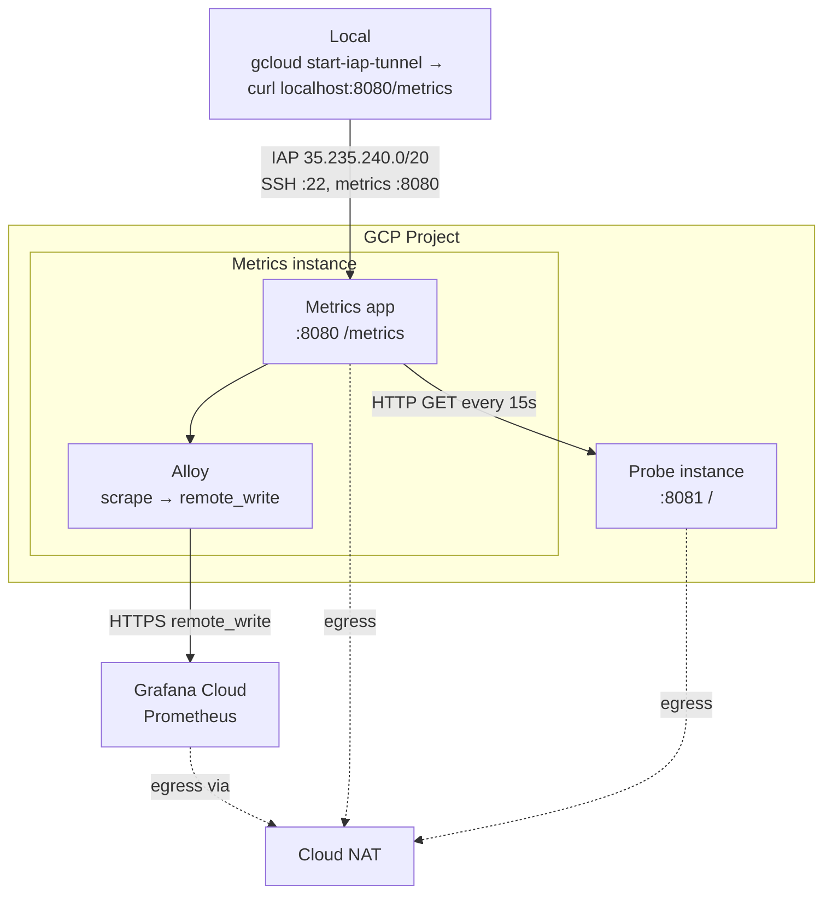
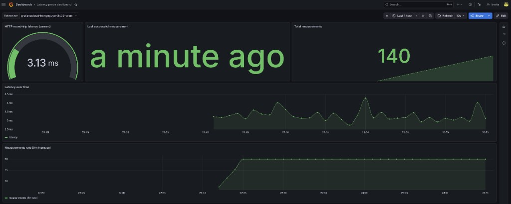

## Overview

- **Metrics instance**: Runs the **metrics app** container (HTTP GETs to the probe every 15s, serves Prometheus-style **`/metrics`** on port 8080) and **Alloy** (scrapes local `/metrics` and **remote-writes to Grafana Cloud**).
- **Probe instance**: Runs a minimal HTTP server **container** on port 8081 so the metrics instance can measure round-trip time.

## Requirements and scope

| Type | Description |
|------|-------------|
| **Functional** | Private-only instances; Prometheus-style `/metrics`; HTTP latency measurement metrics → probe. |
| **Non-functional** | Single-zone, no HA; access only via IAP (SSH and metrics). |
| **Out of scope** | Multi-zone/region, auth/TLS on metrics, persistent metrics storage, alerting. |

## Architecture



## Prerequisites

- **Terraform** >= v1.14.6
- **Google Cloud**: A GCP project with the Compute Engine API enabled. Authenticate via `gcloud auth login`.
- **Docker** if want to run the app locally.

## How to Provision and Deploy

1. **Enable APIs**:
   ```bash
   gcloud services enable compute.googleapis.com containerregistry.googleapis.com storage.googleapis.com --project=caladan-488808
   ```

2. **Build and push both Docker images** (required before instances can start). The repo’s GitHub Action (on push to `main`) builds and pushes to **GitHub Container Registry**; GCP COS must be able to pull from GHCR.

3. **Apply Terraform**:
   ```bash
   cd terraform
   terraform init
   terraform plan    # use terraform.tfvars
   terraform apply
   ```

4. **Access metrics** via IAP tunnel:
   ```bash
   gcloud compute start-iap-tunnel caladan-metrics 8080 --local-host-port=localhost:8080 --zone=asia-southeast1-a --project=caladan-488808
   ```
   In another terminal: `curl http://127.0.0.1:8080/metrics`

5. **Verify** (instances have no public IPs; use IAP only). Example SSH (replace placeholders):
   ```bash
   gcloud compute ssh caladan-metrics --zone=asia-southeast1-a --project=caladan-488808 --tunnel-through-iap
   gcloud compute ssh caladan-probe --zone=asia-southeast1-a --project=caladan-488808 --tunnel-through-iap
   ```

6. **Move local state to GCS** (optional, after first apply). Terraform can create a GCS bucket with versioning for state:
   ```bash
   cp backend.tf.example backend.tf
   # Edit backend.tf: set backend "gcs" bucket to caladan-488808-tfstate.
   terraform init -migrate-state
   ```
   State is then stored at `gs://caladan-488808-tfstate/terraform/state/default.tfstate` with versioning enabled.

## Technology choices and rationale

| Choice | Rationale |
|--------|-----------|
| **Terraform** | Declarative IaC, strong Google provider, fits the “provision two servers” requirement. |
| **GCP + default network** | Default VPC keeps the demo simple. **Cloud NAT** gives instances outbound internet without public IPs. **IAP only** for SSH and metrics (firewall allows 22 and 8080 from 35.235.240.0/20 only); probe 8081 from metrics→probe only. |
| **Python app in Docker** | App is Python packaged as a Docker minimal image, no shell. |
| **Container-Optimized OS** | Both VMs run COS; startup script runs `docker run` for the metrics and the probe-server image. |
| **HTTP-based latency** | HTTP GET to the probe is reliable and easy to implement. |
| **Prometheus-style `/metrics`** | Single HTTP endpoint for latency metrics; familiar format. |

## How to access and interpret the latency metrics

- **URL**: Instances are private-only. Use an IAP TCP tunnel: run `terraform output -raw iap_tunnel_metrics` for the command, or use the template below; then `curl http://localhost:8080/metrics`.
- **Port**: 8080 (configurable via app env; startup script sets it to 8080).

**Start IAP tunnel** (replace `asia-southeast1-a` and `caladan-488808`):

```bash
gcloud compute start-iap-tunnel caladan-metrics 8080 --local-host-port=localhost:8080 --zone=asia-southeast1-a --project=caladan-488808
```

**Example output** when curling `http://127.0.0.1:8080/metrics`:

```
# HELP latency_seconds HTTP round-trip latency to target
# TYPE latency_seconds gauge
latency_seconds 0.003545
# HELP latency_measurements_total Total number of measurements
# TYPE latency_measurements_total counter
latency_measurements_total 704
# HELP latency_last_success_timestamp_seconds Unix time of last successful measurement
# TYPE latency_last_success_timestamp_seconds gauge
latency_last_success_timestamp_seconds 1772285144
```

| Metric | Meaning |
|--------|---------|
| **`latency_seconds`** | Last measured HTTP round-trip time (seconds) from metrics to probe. |
| **`latency_measurements_total`** | Total number of probe attempts since the app started. |
| **`latency_last_success_timestamp_seconds`** | Unix timestamp of the last successful measurement. |

## Assumptions, limitations, and tradeoffs

- **Default network**: Uses the GCP default VPC with **Cloud NAT** for outbound-only access. Instances have **private IPs only**; SSH and metrics are **via IAP only**.
- **Single zone**: Both VMs are in the same zone. No HA or multi-zone.
- **No public IPs**: All access is via [IAP](https://cloud.google.com/iap/docs/using-tcp-forwarding). Firewall allows SSH (22) and metrics (8080) only from the IAP range `35.235.240.0/20`.
- **No auth or TLS on metrics**: The `/metrics` endpoint is not authenticated or encrypted; restriction is network-level (IAP tunnel). Do not expose the tunnel to untrusted networks.
- **Secrets**: No application secrets in this minimal setup; images are pulled from GCR or GHCR with the default node identity. For production, use Secret Manager and avoid storing tokens in env or in Terraform state; keep Terraform state in encrypted GCS with versioning.
- **Compliance**: This is a demo/tooling setup. Do not use for sensitive or regulated data without adding auth, TLS, and access controls.
- **Latency meaning**: Reported latency is the HTTP GET round-trip (TCP + HTTP) to the target’s root path, not pure network RTT or application-level latency.
- **Container-Optimized OS**: Both VMs use COS; startup scripts run containers with `docker run`.
- **Startup script and code changes**: Today, any code/config change effectively requires replacing instances because the app is started by a startup script that runs `docker run` on boot. For fewer replace cycles and faster rollouts, bake the app into a AMI with Packer and use an **instance group** so new versions are rolled out graceful.
- **SSH**: No public IPs; use `gcloud compute ssh ... --tunnel-through-iap`. IAP API is enabled by Terraform.
- **Scale**: Single pair of instances; not designed for high throughput or multi-region.

**What I would do differently in a production setup**:

| Area | TODO |
|------|----------------|
| **Secrets and Terraform state** | Store Prometheus (or other) tokens in [GCP Secret Manager](https://cloud.google.com/secret-manager); reference them from Terraform via `google_secret_manager_secret_version` and inject into the app at runtime. Avoid plain env vars or state for secrets. |
| **Metrics ingestion** | Either **self-host a Prometheus server** (e.g. on a small VM or in GKE) that scrapes the metrics instance via IAP or private IP, or **push metrics to GCP** using Cloud Monitoring
| **CI/CD — build and push to GCR** | Use **GitHub Actions** with a self-hosted runner on GCP and Workload Identity so the runner can `docker build` and push to **private GCR** without long-lived keys. No need to store GCR credentials in GitHub. |
| **Instances pulling from private GCR** | Give the Compute Engine instances a **Workload Identity**-bound service account with `roles/artifactregistry.reader` (or `storage.objectViewer` for GCR). Instances then pull from private GCR with no JSON key; the node identity is used automatically. |
| **Fewer instance replacements** | Avoid relying on startup scripts for every code change. Use **Packer** to build a custom image (e.g. COS or Ubuntu with the app/container baked in), then deploy via an **instance group (MIG)**. Updates become a rolling replace of instances from the new image instead of “delete and recreate” for each change. |

## Latency insights

- **Ideas to improve latency, precision, or consistency**:
   - Reuse a single HTTP client/connection (or use a minimal TCP probe) to reduce connection-setup noise.
   - Take multiple samples per interval and expose percentiles (e.g. p50, p99) in addition to the last value.
   - Run the probe listener as a small static binary (e.g. Go) instead of Python’s `http.server` to reduce server-side variance.

## References

- [Google Cloud IAP TCP forwarding](https://cloud.google.com/iap/docs/using-tcp-forwarding)
- [Prometheus exposition formats](https://prometheus.io/docs/instrumenting/exposition_formats/)
- [Terraform Google provider](https://registry.terraform.io/providers/hashicorp/google/latest/docs)
- [Container-Optimized OS](https://cloud.google.com/container-optimized-os/docs)
- [Cloud NAT](https://cloud.google.com/nat/docs/overview)

## Grafana Cloud dashboard

Alloy remote-writes the latency metrics to Grafana Cloud Prometheus. Example dashboard (HTTP round-trip latency, last success time, total measurements, latency over time, measurements rate):


